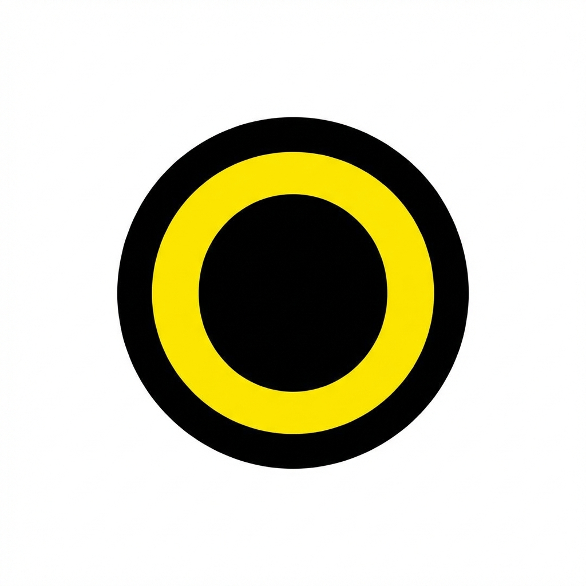

<div align="center">

<!-- Animated wave header -->


<!-- Animated typing intro -->
<a href="https://git.io/typing-svg">
  
</a>

<br/>


</div>

---

## 👨‍💻 About Me

I'm a **BCA graduate** building my career toward **Data Analytics and Business Intelligence**, with a strong full-stack development foundation.

I enjoy working with data to discover patterns, answer practical questions, and turn raw information into clear, useful insights — and I love building complete, production-ready web applications end to end.

**Current focus:** `Python → Pandas → SQL → Power BI → Excel`

I learn by building projects, analyzing real-world datasets, and continuously improving how I approach both data and software problems.

```text
const aadhar = {
    role: "Data Analyst | Aspiring Full Stack Developer",
    based_in: "India",
    currentFocus: ["HTML", "CSS", "JavaScript", "Python", "SQL"],
    funFact: "I debug with print statements before I admit it's a real bug 😅"
};
```

---

## 🧰 Tech Stack

<div align="center">


</div>

---

## 📈 My Data Analytics Journey

<div align="center">

**🐍 Python&nbsp; → &nbsp;🐼 Pandas&nbsp; → &nbsp;🗄️ SQL&nbsp; → &nbsp;📊 Data Analysis&nbsp; → &nbsp;📈 Power BI&nbsp; → &nbsp;💡 Business Insights**

<br/>

| Stage | What I Do |
|:---:|:---|
| 🐍 **Python** | Clean and prep raw data with Pandas |
| 🗄️ **SQL** | Query, join, and analyze structured data |
| 📊 **Power BI** | Build interactive dashboards & reports |
| 💡 **Insights** | Turn numbers into decisions stakeholders can act on |

</div>

---

## 🚀 Featured Projects

### 🟡 Outlier — E-Commerce Clothing Platform

<table>
<tr>
<td width="25%" align="center" valign="top">



<br/><br/>

**OUTLIER**

<sub>E-Commerce Clothing Platform</sub>

</td>
<td width="45%" valign="top">

**Full-Stack E-Commerce Clothing Platform**

A complete e-commerce clothing platform built with **React, Java, Spring Boot and SQL**, featuring customer shopping, vendor management, administration, payments, orders and analytics.

<br/>

<a href="https://github.com/aadhardwivedi/Outlier---E-Commerce-Clothing-">

</a>
&nbsp;
<a href="https://out-lier.vercel.app/">

</a>

</td>
<td width="30%" valign="top">

**✨ Key Features**
- 🛍️ Customer shopping
- 🛒 Cart & wishlist
- 📦 Order management
- 💳 Payment workflow
- 🏪 Vendor dashboard
- ⚙️ Admin panel
- 📊 Analytics & reporting
- 🔐 Authentication & authorization

</td>
</tr>
</table>

**Tech Stack**

<p align="center">
    
</p>

**📸 Preview**

<p align="center">
<a href="https://out-lier.vercel.app/">

</a>
</p>

---

## 📊 GitHub Stats

<div align="center">


</div>

> ⚠️ **Why some cards were removed:** the shared `github-readme-stats.vercel.app` and `github-readme-activity-graph.vercel.app` instances that generate stats/top-langs/activity cards are currently **paused by their owner** (confirmed — they're returning `503 DEPLOYMENT_PAUSED` as of Jan 2026), which is exactly why they showed as broken icons for you. That's not fixable from the README side; the fix is deploying your **own free copy** of that project on Vercel (5 minutes, uses your own GitHub token so it never rate-limits). Say the word and I'll write you the exact step-by-step for that — until then I've kept only the streak-stats card above, which uses a different, currently-working host.

---

## 🐍 Contribution Snake (Animated)

<div align="center">

</div>

> ⚙️ This animated snake needs a **one-time GitHub Action setup** — see the setup guide at the end of this file. It's optional but is the single best "wow" animation for a profile README.

---

## 🤝 Connect With Me

<div align="center">

<a href="https://www.linkedin.com/in/aadhardwivedi/" target="_blank">

</a>
<a href="mailto:aadhardwivedirgh0105@gmail.com">

</a>
<a href="https://github.com/aadhardwivedi" target="_blank">

</a>

</div>

<br/>


